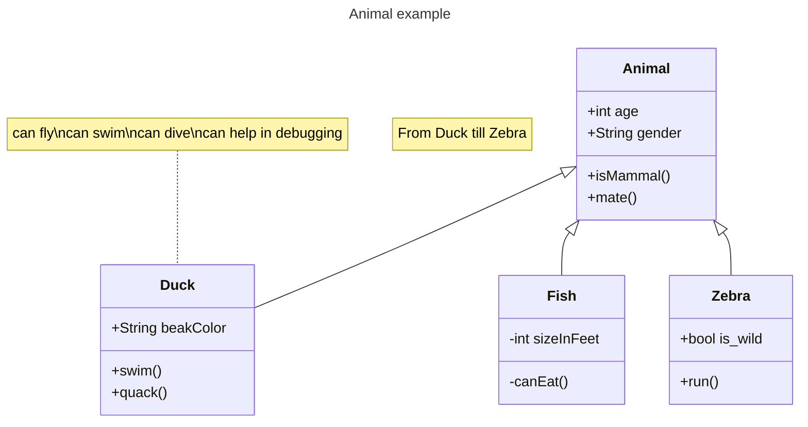

# TowerDefenseTemplate +gedaan
In mijn game komen er piraten die je schat willen stelen aan het einde van het pad.
Je spawnt torens (cannonen) te plaatsen om de piraten dood te maken en je schat veilig te houden.

## Product 1: "DRY SRP Scripts op GitHub" +gedaan

(SRP) - In dit script heb ik een if statement gebruikt om te checken met een bool of het gameobject actief is of niet.
[link](https://github.com/Yatii2/TowerDefense/blob/main/TowerDefense/Assets/MainMenu/Scripts/Activate.cs)

(DRY) - In dit script heb ik een while loop gebruikt om mijn enemies te spawnen per wave waardoor ik niet elke keer een if statement hoef te maken.
[link](https://github.com/Yatii2/TowerDefense/blob/main/TowerDefense/Assets/Scripts/Enemies/RoundManager.cs)

## Product 2: "Projectmappen op GitHub" +gedaan

Je commit de mappenstructuur van je unity project op github en verwijst vanuit je readme naar de root map van je project. Met een netjes en goed gestructureerde mappenstructuur en benamingen van files toon je aan dat je dit leerdoel beheerst. 

Dit is de [ROOT](TowerDefense) folder van mijn unity project.

Zorg dat deze verwijst naar je Develop branch.

## Product 3: Build op Github +gedaan

[Release](https://github.com/Yatii2/TowerDefense/releases)

## Product 4: Game met Sprites(animations) en Textures +gedaan

## Product 5: Issues met debug screenshots op GitHub +gedaan

[Hier de link naar mijn issues](https://github.com/Yatii2/TowerDefense/issues)

## Product 6: Game design met onderbouwing 

Je gebruikt een game design tool om je game design vast te leggen en te communiceren. Daarnaast onderbouw je de design keuzes ten aanzien van “playability” en “replayability” voor je game schriftelijk. 

Voorbeeld van een one page design:

Omschrijf per mechanic welke game design keuzes je hebt gemaakt en waarom je dit hebt gedaan.

*  **Je game bevat torens die kunnen mikken en schieten op een bewegend doel.** 

*Mijn torens hebben ook nog een f.o.v waardoor je pas gaan mikken als enemies in de buurt zijn. ook hebben mijn torens geen 360 graden view maar 90 graden waardoor het een extra uitdaging is voor de speler om de torens ook op de meest tactische manier te roteren.*

*  **Je game bevat vernietigbare vijanden die 1 of meerderen paden kunnen volgen.**  

*Mijn enemies bevatten 3 types: 
1 snelle die ook snel dood gaat. echter als er veel snelle enemies zijn is de kans steeds groter dat ze bij hun doel komen omdat de torens maar 1 enemy tegelijk kan targetten. Het forceert de speler dus om veel goedkope torens te plaatsen.
Ook is er een langzame gepantserde enemy. Deze kan eigenlijk alleen maar worden vernietigd door magische torens die zijn geupgrade. goedkope torens doen bijna geen schade. De speler moet dus een balans gaan zoeken tussen veel goedkope torens en upgraden van torens.
Tot slot is er een vijand die andere enemies healt dit zorgt ervoor dat de speler een extra nadeel heeft en de torens handmatig de deze healer moet laten targetten hierdoor wordt de speler gedwongen om actiever de game te spelen omdat anders geen enkele enemy meer dood gaat.*

*  **Je game bevat een “wave” systeem waarmee er onder bepaalde voorwaarden (tijd/vijanden op) nieuwe waves met vijanden het veld in komen.**

*Onderbouwing hier...*

*  **Een “health” systeem waarmee je levens kunt verliezen als vijanden hun doel bereiken en zodoende het spel kunt verliezen.** 

*Onderbouwing hier...*

*  **Een “resource” systeem waarmee je resources kunt verdienen waarmee je torens kunt kopen en .evt upgraden.**

*Onderbouwing hier...*

*  **Een “upgrade” systeem om je torens te verbeteren.**

*Onderbouwing hier...*

*  **Een “movement prediction” systeem waarmee je kan berekenen waar een toren heen moeten schieten om een bewegend object te kunnen raken. (Moeilijk)**

*Onderbouwing hier...*

## Product 7: Class Diagram voor volledige codebase 

Je brengt je volledige codebase in kaart met behulp van een class diagram. Binnen de classes hoeven geen private members te worden weergegeven. Wel alle public members (fields en methods). Ook geef je indien relevant de relaties tussen je classes weer. Je class diagram plaats je in je readme op github. Evt mag je dit doen m.b.v de [“Mermaid”](https://mermaid.js.org/syntax/classDiagram.html) tool.

## Product 8: Prototype test video 
Je hebt een werkend prototype gemaakt om een idee te testen. Omschrijf if je readme wat het idee van de mechanics is geweest wat je wilde testen en laat een korte video van de gameplay test zien. 

## Product 9: SCRUM planning inschatting +gedaan

Je maakt een SCRUM planning en geeft daarbij een inschatting aan elke userstory d.m.v storypoints / zelf te bepalen eenheden. (bijv. Storypoints, Sizes of tijd) aan het begin van een nieuwe sprint update je deze inschatting per userstory. 

Plaats in de readme een link naar je trello en **zorg ervoor dat je deze openbaar maakt**

[Link naar de openbare trello]([https://trello.com/b/w60wkKSU/examen-paraphrenia](https://trello.com/b/kqA3BrNz/towerdefensem5))

## Product 10: Gitflow conventions
Je hebt voor je eigen project in je readme gitflow conventies opgesteld en je hier ook aantoonbaar aan gehouden. 

De gitflow conventions gaan uit van een extra branch Develop naast de "Master"/"Main". Op de main worden alleen stabiele releases gezet.

Verder worden features op een daarvoor bedoelde feature banch ontwikkeld. Ook kun je gebruik maken van een hotfix branch vanaf develop.

Leg hier uit welke branches jij gaat gebruiken en wat voor namen je hier aan gaat meegeven. Hoe vaak ga je comitten en wat voor commit messages wil je geven?

.

